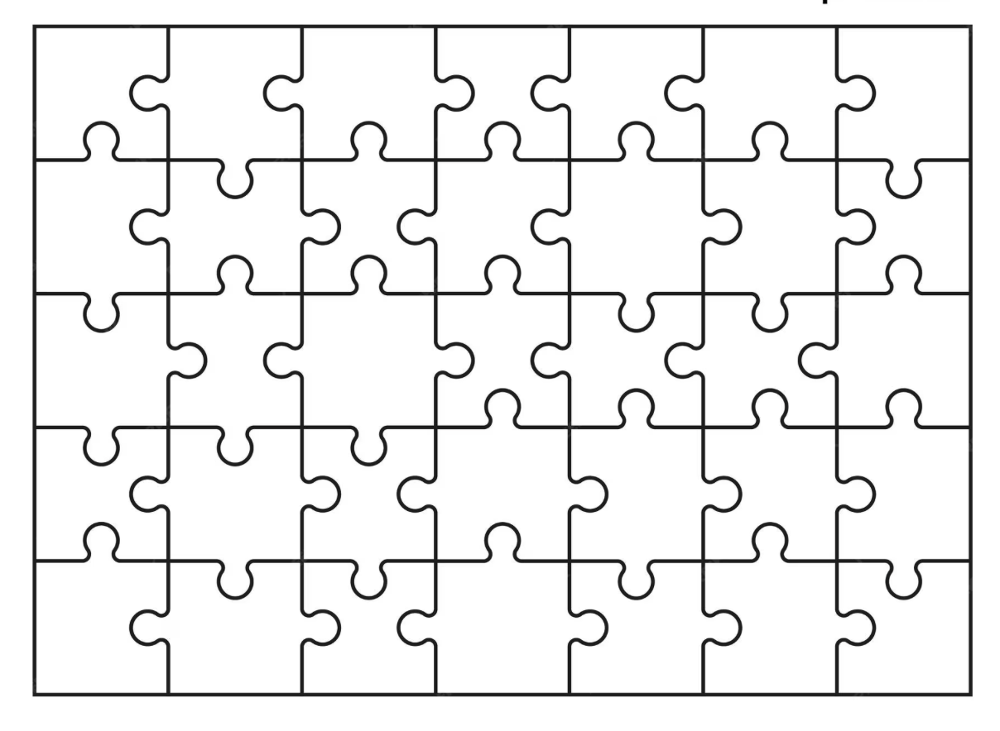
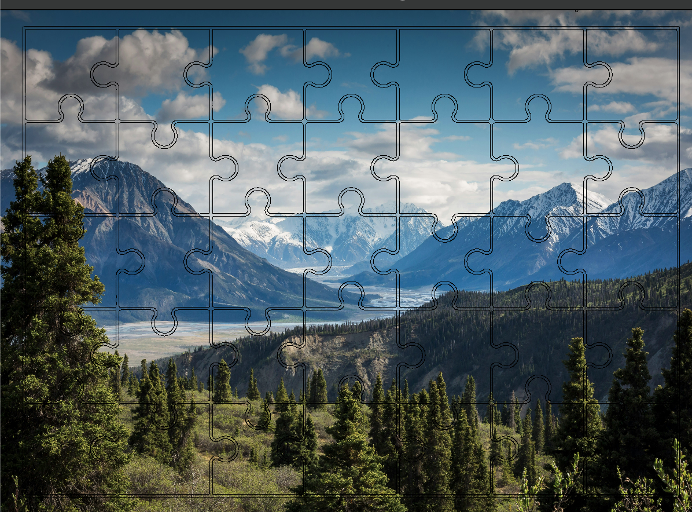

# Puzzle Maker
by Gunnar Funderburk

Takes in a Puzzle Grid and a Photo Via File Explorer Input and Inserts Photo Onto Puzzle Grid
## **Grid**:   

## **Picture**:    
## **Result**:         

          